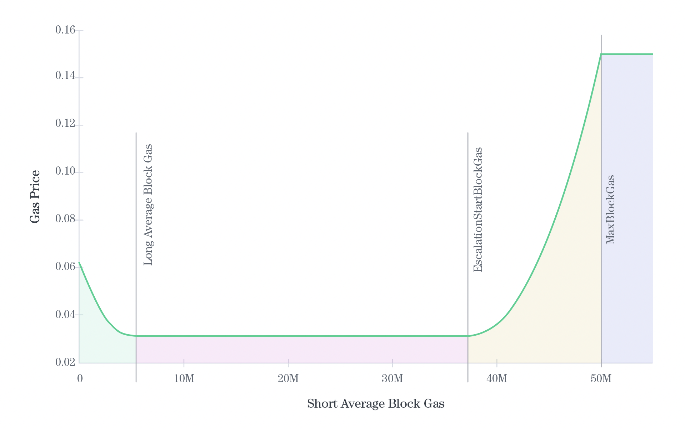

<!--
order: 0
title: Fee model Overview
parent:
  title: "feemodel"
-->

# `x/feemodel`

## Abstract

This document specifies the feemodel module. The module is responsible for calculating minimum gas price required by the chain based on the [parameters](03_params.md) of fee model.

Two charts are presented below, showing how the implemented fee model behaves. Keep in mind that data presented on those charts were generated using `MaxGasPrice` set to `0.15` for better readability, while in reality we use `62.5`.

TERMS:
- *long average block gas* is the EMA (exponential moving average) of gas consumed by previous blocks using `LongEmaBlockLength` parameter for computing the EMA.
- *short average block gas* is the EMA (exponential moving average) of gas consumed by previous blocks using `ShortEmaBlockLength` parameter for computing the EMA.
- `MaxGasPrice = InitialGasPrice * MaxGasPriceMultiplier`
- `EscalationStartBlockGas = MaxBlockGas * EscalationStartFraction`

Chart below presents the dependency between *short average block gas* and minimum gas price required by the network on next block.

There are four regions on the fee model curve:
- green - between 0 and *long average block gas* where gas price goes down exponentially from `InitialGasPrice` to gas price with maximum discount (`InitialGasPrice * (1 - MaxDiscount)`),
- red - between *long average block gas* and `EscalationStartBlockGas` where we offer gas price with maximum discount all the time,
- yellow - between `EscalationStartBlockGas` and `MaxBlockGas` where price goes up rapidly (being an output of a power function) from gas price with maximum discount to `MaxGasPrice`,
- blue - above `MaxBlockGas` (if it happens for any reason) where price is equal to `MaxGasPrice`.

The input (x value) for that function is calculated by taking *short block gas average*.
Price (y value) being an output of the fee model is used as the minimum gas price for the next block.

Second chart presents the model behavior over time, presenting how changes in gas consumed by blocks affect the minimum gas price required by the network. Chart was calculated using fixed *long average block gas` equal to 5 millions. 

- x axis represents block number
- left y axis is related to `ShortEMA` (red line) and `LongEMA` (orange line),
- right axis presents the minimum gas price computed after particular block,
- blue line (almost completely covered by the red one) represents the raw gas consumed by blocks,
- red line is the *short average block gas*,
- orange line is the *long average block gas*,
- green line is the minimum gas price required by the network.

A few things to note:
- whenever `ShortEMA` goes above `MaxBlockGas` price is set to `MaxGasPrice`,
- whenever `ShortEMA` goes above `EscalationStartBlockGas` price starts growing rapidly up to `MaxGasPrice`,
- whenever `ShortEMA` is 0, price is set to `InitialGasPrice`,
- whenever `ShortEMA` is equal to or greater than `LongEMA` maximum discount (`MaxDiscount`) is applied on top of `InitialGasPrice`,
- when `ShortEMA` goes from 0 to `LongEMA` price drops until price with maximum discount is reached.

## Contents

1. **[State](01_state.md)**
2. **[Keeper](02_keeper.md)**
5. **[Parameters](03_params.md)**
